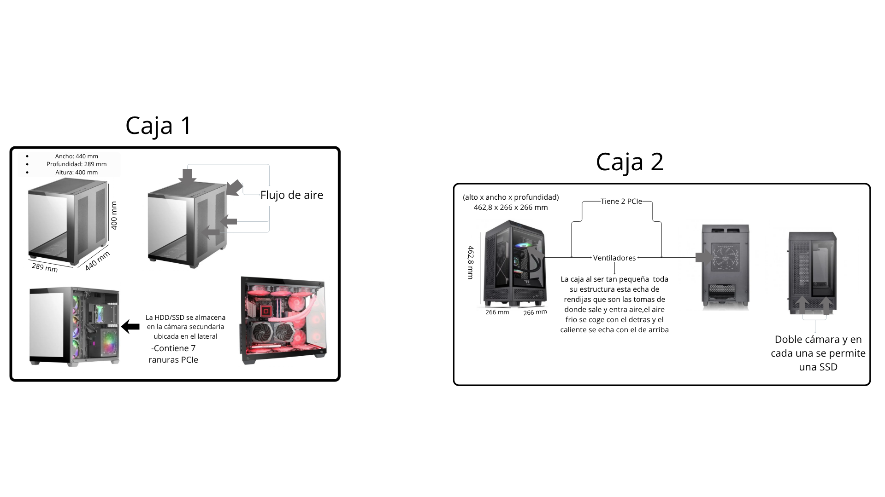

# Reto 02 — Análisis de Chasis (UT2 · RA1)

**Alumno/a:** Soto Soto, Jesus  
**Grupo:**  ASIR
**Fecha:**  08-11-2025
**Repositorio:** [Github_repositorio](https://github.com/JesuSotoSoto/FHW_Proyecto_RA1_UT2)

# Índice

1. [Portada](00-portada.md)
2. [Introducción](02-introduccion.md)
3. [Tabla de materiales](10-tu_tabla_materiales.md)
4. [Formatos y diagrama](20-formatos_y_diagrama/tu_diagrama_y_analisis.md)
5. [Caso práctico](30-caso_practico/tu_resolucion_caso.md)
6. [Reflexión personal](40-reflexion_personal/tu_reflexion.md)
7. [Entrega y checklist](99-entrega_y_checklist.md)

# Introducción

En este documento analizamos **materiales** (acero SECC, aluminio, plástico, vidrio templado y compuestos) y **formatos** de chasis, para entender cómo afectan a **capacidad de componentes**, **refrigeración** y **experiencia de usuario**. Finalmente, resolvemos un **caso práctico**.

## 1) Tabla comparativa de materiales

# Plantilla — Tabla comparativa de materiales de chasis

## 🛠️ Información de Materiales: Ventajas, Desventajas y Aplicaciones

| Material                  | Ventajas                                                                         | Desventajas                                                                                     | Aplicaciones comunes                                                     |
| :-------------------------- | :--------------------------------------------------------------------------------- | :------------------------------------------------------------------------------------------------ | :------------------------------------------------------------------------- |
| **Acero SECC**            | Rentable y más asequible que el acero inoxidable.                               | Sensible a la corrosión si el recubrimiento se daña.                                          | Carcasas de equipos electrónicos (ordenadores, monitores e impresoras). |
|                           | Resistencia a la corrosión adecuada.                                            | Pérdida de fuerza a temperaturas elevadas.                                                     | Mobiliario metálico(gabinetes y estanterías).                          |
|                           | Gran flexibilidad haciendo que sea muy dificil de romper                         | Puede ser sensible a ciertas torceduras o movimientos** extremos.                               | Componentes de máquinas de oficina (fotocopiadoras)                     |
| **Aluminio**              | Es muy ligero, mucho mas que el acerro (3 veces mas o menos)                     | Menor resistencia a la tracción que el acero.                                                  | Industria automotriz y aeroespacial(piezas estructurales, carrocerías). |
|                           | Excelente resistencia a la corrosión.                                           | El aluminio puro es blando; requiere de aleación.                                              | Marcos de ventanas y puertas.                                            |
|                           | Es un gran disipador de calor,se calienta y se enfria muy rapido                 | Mayor costo inicial en comparación con algunos plásticos o el acero común.                   | Envases de alimentos y bebidas (latas).                                  |
| **Plástico**             | Bajo costo de producción y gran disponibilidad.                                 | Es muy dañino para el medio ambiente                                                           | Embalajes (botellas, contenedores, films).                               |
|                           | Ligero y muy fácil de moldear en formas complejas.                              | Dependencia de recursos no renovables (petróleo) para su fabricación.                         | Componentes de automóviles (paragolpes, carcasas).                      |
|                           | Aislante térmico y eléctrico.                                                  | Es no recicable ,es decir,no se puede volver a su forma de materia prima.                       | Tuberías y aislamientos en la construcción (PVC).                      |
|                           | Resistencia química y alta durabilidad.                                         |                                                                                                 | Electrónica (carcasas de dispositivos, cables).                         |
| **Vidrio templado**       | Hasta cinco veces más resistente que el vidrio común.                          | No puede cortarse, pulirse ni taladrarse después del templado                                  | Mamparas de baño y duchas.                                              |
|                           | Seguridad en caso de rotura (se fragmenta en trozos pequeños y menos afilados). | Mayor costo que el vidrio recocido (normal).                                                    | Puertas y ventanas de seguridad.                                         |
|                           | Resiste altas temperaturas y cambios bruscos de temperatura.                     | Puede sufrir una rotura espontánea muy ocasionalmente si hay impurezas o daños en los bordes. | Protectores de pantalla para dispositivos electrónicos.                 |
| **Materiales compuestos** | Elevada relación resistencia-peso (alta resistencia con bajo peso).             | Costo de fabricación que puede ser alto (especialmente la fibra de carbono).                   | Aeroespacial (componentes de aeronaves, fuselaje).                       |
|                           | Excelente resistencia a la corrosión.                                           | La reciclabilidad y reutilización puede ser más compleja que en materiales simples.           | Automotriz (piezas de alto rendimiento, carrocerías de F1).             |
|                           | Flexibilidad de diseño para crear formas complejas y optimizadas.               | Puede requerir procesos de fabricación complejos (como moldeo o infusión).                    | Construcción (hormigón armado, estructuras avanzadas).                 |
|                           | Propiedades adaptadas a la aplicación específica (al combinar materiales).     |                                                                                                 | Deportes (bicicletas, palos de golf, esquís).                           |

## 2) Formatos: diagrama y análisis

# Plantilla — Formatos de chasis: diagrama y análisis

**Formatos elegidos:** (ej.: Torre Completa vs Mini Torre)

## Diagrama (inserta tu imagen)

# Impacto del tamaño

## Caja 1

- **Placas base compatibles:** E-ATX / ATX / Micro-ATX / Mini-ITX
- **Bahías:** 2 × 3.5" HDD + 3 × 2.5" SSD
- **Longitud máxima GPU:** 418 mm
- **Altura máxima disipador CPU:** 162 mm
- **Ranuras PCIe:** 7
- **Fuente de alimentación:** ATX estándar
- **Cámaras:** doble cámara modular (fuente y discos separados)

**Refrigeración**

- **Ventiladores admitidos:** hasta 10 × 120 mm o 4 × 140 mm
- **Radiadores compatibles:** 360 / 280 / 240 mm (frontal, superior, o lateral según configuración)
- **Flujo de aire:** configurable — permite presión positiva o negativa dependiendo de la orientación de ventiladores
- **Soporte para custom loop:** **sí**, muy adecuada para montajes con depósito, bomba y radiadores grandes
- **Filtros de polvo:** presentes (malla y frontal)

**Uso típico**

- **Gaming exigente / Custom PC / Workstation potente**
- Ideal para sistemas con GPU de gran tamaño, refrigeración líquida completa o múltiples unidades de almacenamiento.
- No recomendable si buscas un formato compacto o un equipo silencioso de oficina.

## Caja 2

- **Capacidad de componentes:** (GPU largas, nº de bahías 3.5"/2.5", nº de ranuras PCIe…)
- **Refrigeración:** (ventiladores admitidos, presión positiva/negativa, espacio para AIO/custom loop…)
- **Uso típico:** (workstation, gaming, ofimática, HTPC…)

**Capacidad de componentes**

- **Placas base compatibles:** Mini-ITX
- **Bahías:** 2 × 2.5" SSD + 2 × 3.5" HDD
- **Longitud máxima GPU:** 330 mm
- **Altura máxima disipador CPU:** 190 mm
- **Longitud máxima PSU:** 180 mm
- **Ranuras PCIe:** 2
- **Paneles:** triple cristal templado (frontal + laterales)

**Refrigeración**

- **Ventiladores incluidos:**
  - 1 × 120 mm (superior)
  - 1 × 120 mm (trasero)
- **Ventiladores adicionales posibles:**
  - Superior / trasero / parte superior de la PSU: 1 × 120 mm o 1 × 140 mm adicionales
- **Radiadores compatibles:** 1 × 120 mm (superior)
- **Flujo de aire:** centrado en extracción vertical (el aire caliente sale hacia arriba)
- **Soporte para custom loop:** **limitado**, ideal solo para AIO de 120 mm
- **Filtros de polvo:** magnéticos y desmontables

**Uso típico**

- **Gaming compacto / Mini-ITX Premium / HTPC**
- Ideal para setups pequeños, con estética premium y buena visibilidad de componentes.
- No apta para montajes de refrigeración líquida avanzada ni placas ATX/E-ATX.

## 3) Caso práctico

# Plantilla — Caso práctico: recomendación de chasis

## 1) Formato recomendado
**Elección:** Full Tower / E-ATX

**Por qué:**  
- Espacio suficiente para múltiples GPUs largas  
- Gran número de bahías para HDD y SSD (modulares y extraíbles)  
- Excelente flujo de aire con paneles de malla y soporte para múltiples ventiladores  
- Compatible con radiadores grandes para refrigeración líquida  
- Espacio para una gestión de cables limpia y ordenada  

## 2) Material recomendado
**Elección:** Acero + aluminio

**Por qué:**  
- Rigidez suficiente para soportar varias GPUs pesadas  
- Peso equilibrado: robusto pero manejable  
- Coste razonable dentro de gamas alta/profesional  
- Estética profesional y moderna  
- Buena disipación de calor  
- Reducción de vibraciones, especialmente con discos mecánicos

## 4) Reflexión personal

# Plantilla — Reflexión personal (≥100 palabras)

Comenta cómo el chasis afecta a la **experiencia del usuario**:
- **Ruido del sistema:** Segun que tipo de chasis puedes tener muchas vibraciones y sonido haciendo que sea muy molesto y que debido a las vibraciones puedan llegar a tener consecuencias en el sistema interno
- **Temperatura:** La fluctacion de aire es muy importante y segun que tipo de tareas que quieres realizar la forma de tratarla puede ser diferente.Yo creo que lo mejor es tener la torre en una zona despejada que tenga buena ventilacion y que tenga al menos de 2 a 3 ventiladores y si te lo puedes permitir tener refrigeracion liquida,aunque es muy tediosa y esta enfocada para tareas muy exigentes
- **Acceso a puertos:** Yo creo que lo ideal son 5 PCIe si no vas a exigir mucho al PC y segun que tipo de exigencias tengas pues ir buscando mas o meno y sobre los usb lo ideal seria entre 3-4
- **Estética:** Para empezar la estetica no es importante si lo que buscas es rendimiento solamente, pero si buscas las dos yo creo que lo ideal seria que fuese de material de acero+aluminio debido a que es una gran aleación ya que se complementan muy bien por sus caracteristicas:el acero es muy resistente y el aluminio disipa muy bien el calor.Por ultimo buscar que tenga un cristal que te permita ver el pc internamente ya que por lo menos para mi es bastante estica,aunque, no es muy util si buscas rendimiento ademas esto depende de tus gustos y para que usaras el PC.

